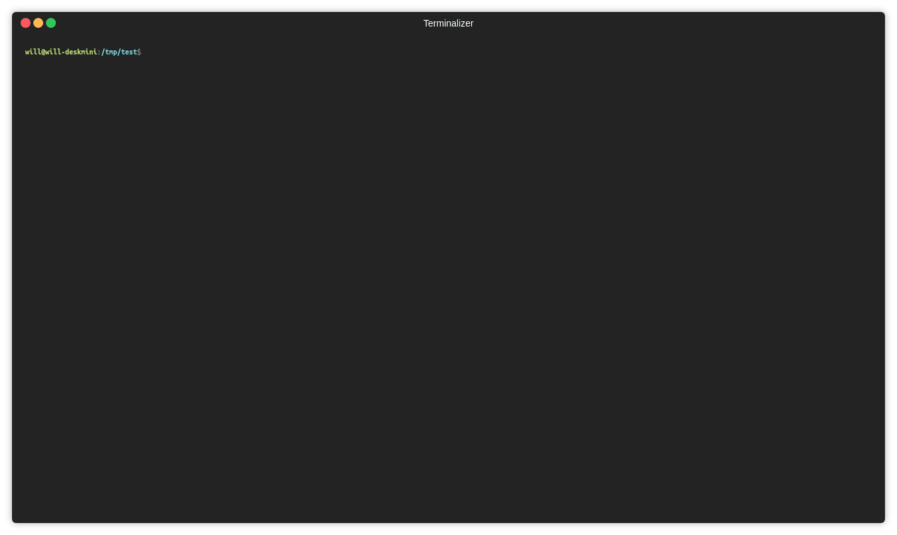

# kubectl-pyflame

Use [pyflame](https://github.com/uber/pyflame) to snapshot flame graph on running python pod in k8s cluster.

example svg file:

## Install

wget https://raw.githubusercontent.com/monsterxx03/kube-pyflame/master/kubectl-pyflame 

chmod +x kubectl-pyflame 

mv kubectl-pyflame /usr/local/bin/

kubectl pyflame -h

## Usage

    kubctl pyflame -n <namespace> -p <pod_name> -m <python process match> -r <inspect rate> -s <inspect seconds>

svg file will be donwloaded to current dir.

## Internal

Steps:

- find running node for target pod
- launch a pod with pyflame image on target node (to inspect process in another namespace, container is `privileged`, pod is set `hostPID: true`)
- list target process match `-m` option
- enter target pid
- pyflame do snapshot and output svg file
- download svg file to local
- delete debug pod
